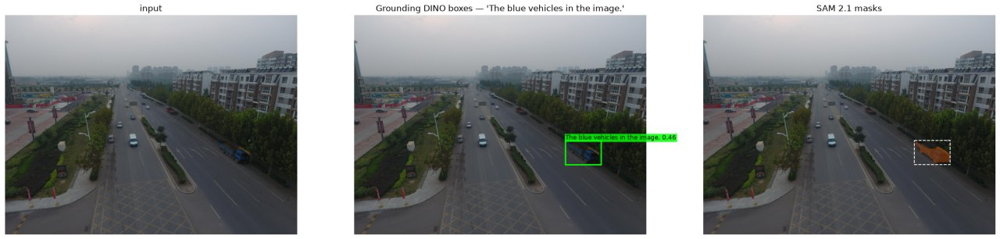
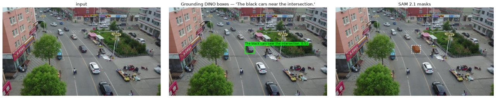
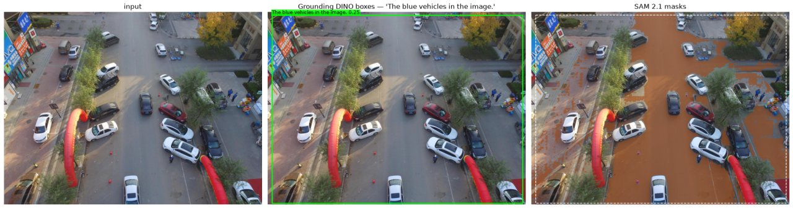
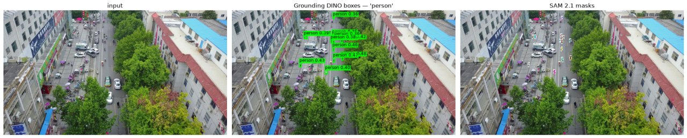
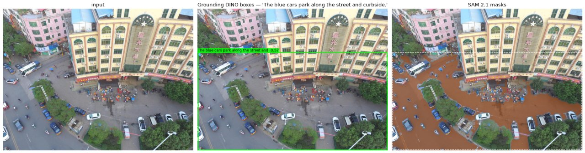
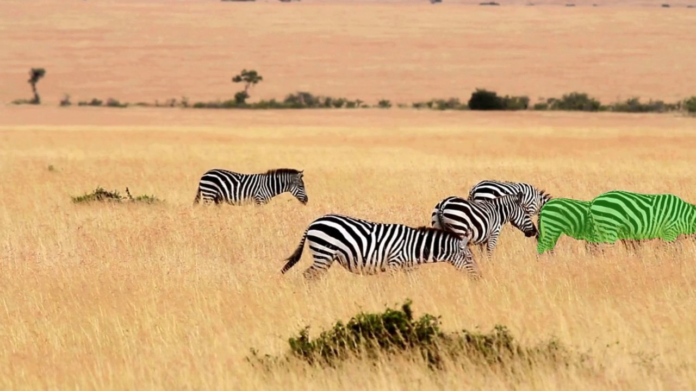
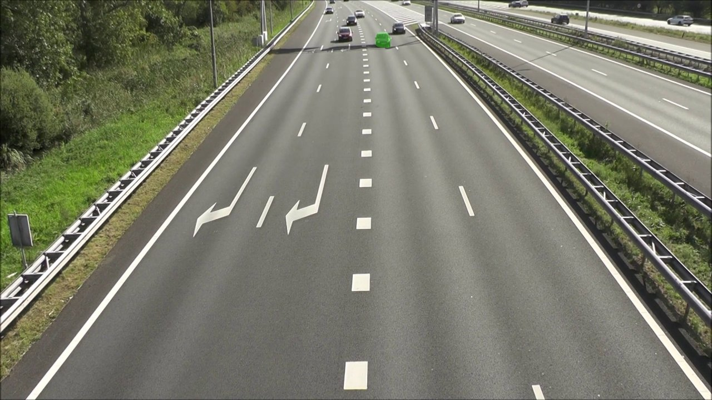

# Figures

Curated from `outputs/` (which is gitignored). Regenerate with
`python scripts/make_figures.py`.

### 01_detection_success.jpg

SUCCESS. 'The blue vehicles in the image.' -> 1 box, IoU 0.84 vs GT. SAM 2 mask is tight on the vehicle.

### 02_detection_failure_qualifier_ignored.jpg

FAILURE, and the characteristic one. 'The black cars near the intersection.' -> 10 boxes, top-1 IoU 0.00. GD resolved the CATEGORY (cars) and ignored the referring qualifiers ('black', 'near the intersection'). SAM 2 then segmented the wrong box perfectly -- a confident, clean mask on the wrong object.

### 03_prompt_ambiguity_same_expression.jpg

AMBIGUOUS PROMPT. The SAME expression as figure 01 -- 'The blue vehicles in the image.' -- on a different frame scores IoU 0.00. Identical prompt, 0.84 vs 0.00. The expression is not the controlling variable; the scene is.

### 04_small_aerial_targets.jpg

SMALL AERIAL TARGETS. 'person' on a 1920x1080 VisDrone aerial frame -> 13 detections, top score 0.48 (vs 0.67 for 'car' on the same frame). Confidence degrades sharply as target size shrinks.

### 05_multiple_similar_targets.jpg

MULTIPLE SIMILAR TARGETS. 'The blue cars park along the street and curbside.' -> 8 boxes for 8 GT objects, yet top-1 IoU 0.01. The detector finds the right NUMBER of the right class and still cannot pick the referent. Taking the highest-confidence box is close to arbitrary here.

### 06_tracking_success.jpg

TRACKING SUCCESS. zebra.mp4, frame 199 of 200. One-time GD acquisition on frame 0, then SAM 2.1 Tiny propagation with NO re-detection. 200/200 frames masked, zero empty, coherent single-animal mask, survived a mutual-occlusion event at f28-30.

### 07_tracking_failure_identity_switch.jpg

TRACKING FAILURE -- the important one. tracking_car.mp4 frame 176. The car GD acquired on frame 0 drove out of the BOTTOM of the frame at f69 and is gone for good. At f176 SAM 2 silently re-bound object id 1 to a DIFFERENT car 953 px away, near the horizon, and reports it with full confidence. SAM 2 has no terminal 'object is gone' state and no identity check, and the detector never re-runs, so nothing corrects it. A naive empty-mask metric scores this false positive as a successful RECOVERY.
