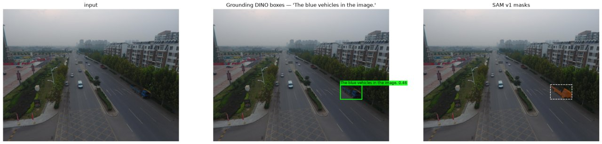
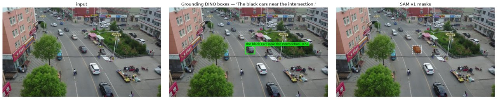
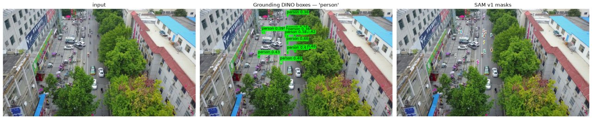
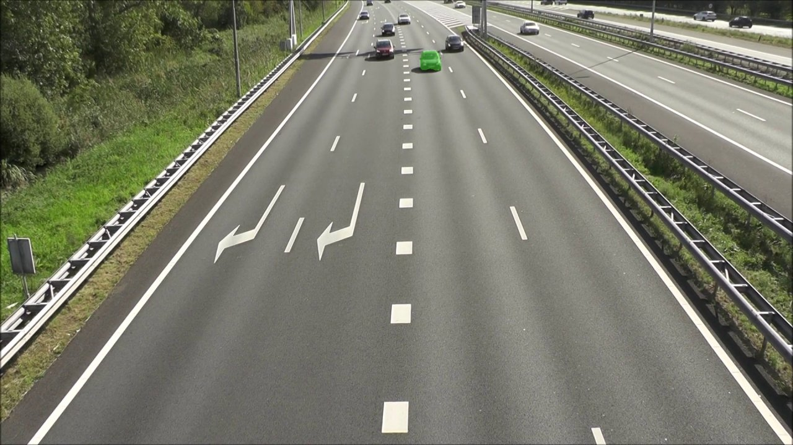
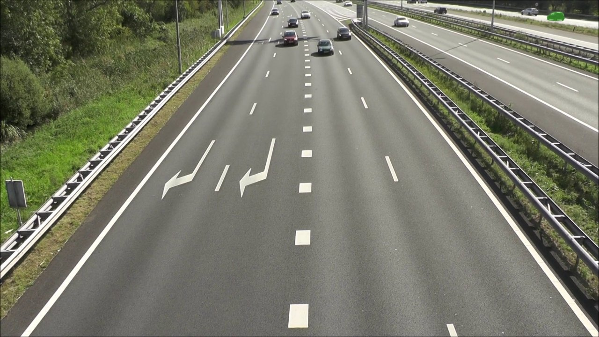

# Figures

Curated from `outputs/` (which is gitignored). Regenerate with
`python scripts/make_figures.py`.

### 01_sam_v1_mask_quality.jpg

SAM v1 SEGMENTATION IS GOOD. 'The blue vehicles in the image.' -> 1 box, IoU 0.84 vs GT, and the SAM v1 (ViT-B) mask is tight on the vehicle. Given a correct box, SAM v1 is not the weak link -- same conclusion as SAM 2. The difference is cost, not quality: this mask took ~107 ms vs SAM 2's ~26 ms.

### 02_shared_grounding_failure.jpg

THE FAILURE IS IN THE DETECTOR, AND IT IS SHARED. 'The black cars near the intersection.' -> 10 boxes, top-1 IoU 0.00. Grounding DINO resolved the CATEGORY (cars) and ignored the referring qualifiers, then SAM v1 segmented the wrong box perfectly. This is the SAME detector and the SAME box the SAM 2 run scored (0 box mismatches over all 50 pairs), so this failure is identical in both pipelines -- swapping the SAM version changes nothing here.

### 03_small_aerial_targets.jpg

SMALL AERIAL TARGETS. 'person' on a 1920x1080 VisDrone frame -> 13 detections, top score 0.48 (vs 0.67 for 'car' on the same frame). A detector property, identical to the SAM 2 evaluation.

### 04_no_identity_frame192.jpg

PER-FRAME 'TRACKING', FRAME 192. SAM v1 has no memory, so every frame is an independent detect+segment. Here the highest-confidence 'car' is one of the cars in the centre lanes and SAM v1 masks it cleanly.

### 05_no_identity_frame193_hop.jpg

THE NEXT FRAME, 193 -- THE NO-IDENTITY FAILURE. The top-1 mask has jumped ~746 px to a completely DIFFERENT car near the top-right horizon. Nothing is wrong with the mask; there is simply no object identity linking frame 193 to 192. 'Which car' is re-decided every frame by confidence (27 such hops in 200 frames on this clip). SAM 2's memory is exactly what prevents this; SAM v1 has no memory to prevent it with.

### 06_perframe_zebra.jpg

PER-FRAME zebra.mp4, frame 100. Detection rate is 100% (there is always a zebra in view) and the mask is clean, but throughput is 4.3 FPS because Grounding DINO runs on every frame -- vs 32.5 FPS for SAM 2's detect-once-then-propagate on the same clip. 20 top-1 hops between the ~6 zebras present per frame.
